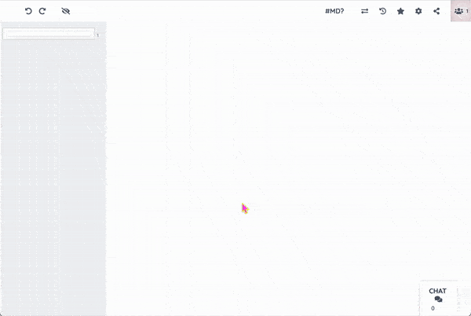

## Markdown editing in Etherpad

This plugin enhances Etherpad for Markdown-style writing.
It does this in multiple ways:
- It enables automatic generation of a Table of Contents based on Markdown-style hashsign headings (#, ##, etc.) in Etherpad documents (can be disabled through settings). === style headings are not supported at the moment, and likely will never be.
- It styles the headings to make it easier to scan long documents for chapters (can be disabled through settings)
- It adds a button to the toolbar that shows a quick cheatsheet for Markdown syntax
- It removes the default text styling buttons from the toolbar (can be reenabled through settings)

It was developed as a compagnion to [Octomode](https://cc.vvvvvvaria.org/wiki/Octomode), a collective editing space for PDF making, using Etherpad, Paged.js and Flask. 
It borrows heavily from the excellent [ep_headings2](https://github.com/ether/ep_headings2) plugin.

## Requirements

Etherpad 2.3.0 (maybe lower, untested)

## Licence
This repository is published under the [CC4r*](https://constantvzw.org/wefts/cc4r.en.html) license.